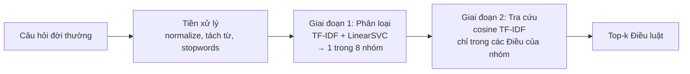

# Giải thích chi tiết notebook và demo

Tài liệu cho nhóm đọc trước khi thuyết trình: mỗi phần notebook làm gì, vì sao làm vậy, số liệu nói lên điều gì, và demo hoạt động ra sao.
Mọi con số dưới đây lấy từ `reports/results.json` của lần chạy hiện tại (model LinearSVC). Chạy lại notebook thì số có thể lệch nhẹ, lấy số trong báo cáo làm chuẩn.

- Notebook: `notebooks/uit_ohs_law_retrieval.ipynb` (sinh từ `scripts/build_notebook.py`, đừng sửa tay file .ipynb).
- Demo: `app.py` (Streamlit).
- Code dùng chung: `src/` (`preprocess.py`, `dataset.py`, `models.py`, `retrieval.py`, `config.py`).

---

## 0. Bức tranh tổng thể



- **Giai đoạn 1 (phần Machine Learning chính):** phân loại câu hỏi vào 8 nhóm quy định của Luật ATVSLĐ 84/2015 (Điều 1–62).
- **Giai đoạn 2 (Information Retrieval):** trong nhóm đã đoán, xếp hạng các Điều bằng độ giống cosine giữa câu hỏi và nội dung Điều.
- Lý do chia 2 giai đoạn: có 62 Điều nhưng dữ liệu chỉ 1600 câu. Phân loại trực tiếp 62 lớp thì mỗi lớp quá ít mẫu. Gom thành 8 nhóm giúp mô hình học ổn định, rồi retrieval xử lý bước chọn Điều.

### 8 lớp nhãn

| Lớp | Mã | Nội dung | Số Điều |
|---|---|---|---|
| C0 | QUY_DINH_CHUNG | Quy định chung, quyền và nghĩa vụ (Đ1–12) | 12 |
| C1 | BIEN_PHAP_PHONG_NGUA | Biện pháp phòng ngừa, cải thiện điều kiện làm việc | 15 |
| C2 | PHUONG_TIEN_BAO_HO | Phương tiện bảo vệ cá nhân (Đ23) | 1 |
| C3 | SUC_KHOE_BOI_DUONG | Khám sức khỏe, bệnh nghề nghiệp, bồi dưỡng hiện vật | 4 |
| C4 | KHAI_BAO_DIEU_TRA | Khai báo, điều tra, thống kê tai nạn (Đ34–37) | 4 |
| C5 | CHE_DO_BOI_THUONG | Bồi thường, trợ cấp TNLĐ do **công ty** trả (Đ38–40) | 3 |
| C6 | HUAN_LUYEN_ATLD | Huấn luyện an toàn, vệ sinh lao động (Đ14) | 1 |
| C7 | BAO_HIEM_TNLD | Bảo hiểm TNLĐ-BNN do **Quỹ BHXH** trả (Đ41–62) | 22 |

Mỗi Điều thuộc đúng 1 lớp (`ARTICLE_TO_LABEL` trong `src/config.py`). Nhãn của câu hỏi **suy ra từ Điều** trả lời câu đó, người gán/LLM không tự chọn lớp. Nhờ vậy nhãn nhất quán.

Điểm dễ bị hỏi: **C5 và C7** đều nói về tai nạn lao động. Khác nhau ở người trả tiền: C5 là trách nhiệm của công ty, C7 là Quỹ bảo hiểm.

---

## 1. Notebook, từng phần

### Cell đầu: import và cấu hình
- Thêm thư mục gốc repo vào `sys.path` để import `src.*`.
- Font `Arial Unicode MS` để biểu đồ hiện đúng tiếng Việt.
- `RESULTS = {}`: mọi số liệu được gom vào dict này và cuối notebook ghi ra `reports/results.json`. **Báo cáo Word và slide đọc số từ file này**, nên không có con số nào gõ tay.

### Mục 1. Mô tả bộ dữ liệu
Có 3 nguồn dữ liệu:

| Nguồn | Số lượng | Dùng để |
|---|---|---|
| Corpus Điều luật (`data/ohs_law_articles.json`) | 93 Điều, dùng Đ1–62 | Văn bản để tra cứu |
| Câu hỏi synthetic (`data/raw/gen/c0..c7.jsonl`) | 1600 câu = 8 lớp × 40 câu gốc × 5 văn phong | Train / val / test |
| Câu hỏi thật (chinhsachonline.chinhphu.vn) | 176 câu thu thập: 42 trong phạm vi, 127 ngoài phạm vi, 7 nhiều ý | Chỉ để đánh giá, không train |

- **5 văn phong** cho mỗi câu gốc: trung tính, công nhân, nhân sự/HSE, khiếu nại, rút gọn. Mục đích: mô phỏng nhiều kiểu người hỏi.
- Synthetic do LLM (Claude) sinh theo `docs/labeling-guidelines.md`, kiểm bằng `scripts/validate_generated.py` và nhóm đọc mẫu 40 câu (40/40 đúng).
- Nhãn câu thật do GPT gán theo Điều mà Bộ trả lời viện dẫn. 1 thành viên gán nhãn mù kiểm chứng: đồng thuận 98.3%, kappa 0.96 (`reports/agreement.json`).

**Phân chia Train/Val/Test** = 1140 / 230 / 230, theo **nhóm câu gốc** (`seed_id`):
- 5 văn phong của cùng 1 câu gốc gần như cùng nội dung. Nếu chia ngẫu nhiên, bản "trung tính" nằm ở train còn bản "rút gọn" nằm ở test, mô hình chỉ cần nhớ là đoán đúng → điểm bị thổi phồng (data leakage).
- `StratifiedGroupKFold` giữ trọn nhóm trong 1 tập và giữ tỉ lệ lớp.
- Cell kiểm tra in ra số câu gốc giao nhau giữa các tập, phải bằng 0.

### Mục 2. EDA
- **Số mẫu mỗi lớp:** 200 câu/lớp, cân bằng. **Số Điều mỗi lớp** lệch mạnh (C2, C6: 1 Điều; C7: 22 Điều), ảnh hưởng tới độ khó của bước tra cứu.
- **Độ dài câu:** trung bình 20.5 âm tiết (5–42). Theo văn phong: rút gọn 7.2, trung tính 20.1, công nhân 20.2, khiếu nại 25.8, nhân sự/HSE 29.2.
- Câu hỏi thật trung bình **106 âm tiết**, dài gấp khoảng 5 lần synthetic. Đây là nguồn gốc của domain shift ở phần sau.
- **Word cloud** và **top từ TF-IDF** mỗi lớp: để thấy mỗi lớp có từ đặc trưng riêng (vd C2: bảo_hộ, cấp, phương_tiện bảo_vệ, cá_nhân), chứng minh bài toán học được bằng từ vựng.

### Mục 3. Tiền xử lý (`src/preprocess.py`)
1. **normalize:** Unicode NFC, chữ thường, bỏ URL/email/HTML/ký tự đặc biệt.
2. **Tách từ tiếng Việt** bằng `underthesea`: *bảo hộ* → `bảo_hộ`, *công ty* → `công_ty`. Tiếng Việt viết cách theo âm tiết nên cần ghép lại thành từ.
3. **Lọc stopwords** (`data/stopwords_vi_legal.txt`) nhưng **giữ từ phủ định và điều kiện** (không, chưa, cấm, được, phải, nếu). Trong câu hỏi luật, "có được không" và "không được" khác nghĩa hoàn toàn.
4. **TF-IDF** (1,2)-gram, `sublinear_tf`, `min_df=2`, tối đa 5000 đặc trưng.

Ví dụ trong notebook:

| Bước | Kết quả |
|---|---|
| Gốc | Đồ bảo hộ toàn hàng chợ không có tem mác gì, công ty phát cho vậy có được không? |
| normalize | đồ bảo hộ toàn hàng chợ không có tem mác gì công ty phát cho vậy có được không |
| đầy đủ | đồ bảo_hộ toàn hàng chợ không có tem_mác gì công_ty phát có được không |

Điểm quan trọng: TF-IDF nằm **trong Pipeline** của sklearn, nên khi cross-validation, vectorizer chỉ học từ vựng trên phần train của từng fold. Không leakage từ val/test.

### Mục 4–5. Mô hình và tinh chỉnh siêu tham số (`src/models.py`)

| Mô hình | Ý tưởng | Lưới tham số |
|---|---|---|
| Multinomial Naive Bayes | Xác suất, giả định các từ độc lập. Baseline nhanh | `alpha` |
| Logistic Regression | Tuyến tính + softmax, loss cross-entropy | `C`, `class_weight` |
| LinearSVC | Tuyến tính, tìm siêu phẳng lề lớn nhất, loss hinge | `C`, `loss`, `class_weight` |
| Random Forest | Nhiều cây quyết định bỏ phiếu | `n_estimators`, `max_depth`, `min_samples_leaf` |

- `GridSearchCV` + `StratifiedGroupKFold(5)` trên train, tối ưu **Macro-F1**.
- **Chọn mô hình theo val**, không theo test. Test và test thật chỉ để báo cáo. Nếu chọn theo test thì test không còn là đánh giá độc lập.

### Mục 6. Đánh giá

| Mô hình | CV F1 | Train F1 | Val F1 | Test F1 | Thật F1 |
|---|---|---|---|---|---|
| **LinearSVC** | 82.82% | 99.91% | **86.93%** | 90.51% | 62.00% |
| Logistic Regression | 83.58% | 99.03% | 86.14% | 90.33% | 60.30% |
| Multinomial NB | 78.00% | 98.33% | 81.21% | 85.95% | 54.81% |
| Random Forest | 81.70% | 100.00% | 80.25% | 86.19% | 51.16% |

Tham số tốt nhất của LinearSVC: `C=1.0`, `loss=hinge`, `class_weight=balanced`.

Cách đọc:
- **Vì sao Macro-F1:** trung bình F1 đều giữa các lớp, lớp nhỏ không bị lớp lớn lấn át. Quan trọng với tập thật vốn lệch lớp.
- **LinearSVC được chọn** vì val cao nhất. Nhưng CV lại xếp Logistic Regression cao hơn (83.58 so với 82.82), và độ lệch chuẩn giữa các fold khoảng 6–7 điểm. Kết luận trung thực: **hai mô hình tuyến tính ngang nhau**, không khẳng định SVC vượt trội.
- **Vì sao mô hình tuyến tính thắng:** TF-IDF là dữ liệu thưa, hàng nghìn chiều, ít mẫu. Mô hình tuyến tính có điều chuẩn làm việc tốt ở dạng này. Random Forest chia theo từng đặc trưng nên khó tận dụng nhiều từ hiếm.
- **Overfitting:** mọi mô hình có train F1 gần 100%, chênh train–val trên 10 điểm (LinearSVC 12.98, RF 19.75). Có dấu hiệu overfit, nhưng val/test vẫn cao vì chia theo nhóm nên đây là số thật.
- **Test thật 62% so với test synthetic 90.5%:** chênh 28.5 điểm. Giả thuyết là domain shift: câu thật dài hơn nhiều, nhiều bối cảnh, dẫn chiếu Nghị định. Tập thật chỉ 42 câu và không có câu nào thuộc C2 nên Macro-F1 thật tính trên 7 lớp, dao động lớn.

**F1 từng lớp (test synthetic):** thấp nhất C0 QUY_DINH_CHUNG 71.7% và C1 BIEN_PHAP_PHONG_NGUA 77.2%. Cao nhất C6 98.4%, C5 98.3%.

**Ma trận nhầm lẫn:** hàng là lớp thật, cột là lớp dự đoán, đường chéo là đoán đúng.
- Cặp nhầm nhiều nhất (cộng cả 4 mô hình): C1 → C0 30 lần, C0 → C1 13 lần, C4 → C0 11 lần.
- Lý do: C0 (quyền, nghĩa vụ chung) và C1 (biện pháp của doanh nghiệp) cùng nói về trách nhiệm chung về an toàn, từ vựng chồng lấn.

**Feature importance (Random Forest):** top-20 từ mô hình dựa vào nhiều nhất, dùng để giải thích mô hình học được gì.

### Mục 7. Ablation study
Mỗi cặp chỉ đổi **một** yếu tố, cùng LinearSVC, cùng tham số, cùng split.

| Cấu hình | CV F1 (± std) | Val | Test | Thật |
|---|---|---|---|---|
| #1 Full (tách từ + stopwords + 1-2gram) | 82.82 ± 6.62 | 86.93 | 90.51 | 62.00 |
| #2 Không tách từ | 82.15 ± 5.97 | 86.70 | 92.93 | 58.59 |
| #3 Chỉ unigram | 83.18 ± 5.30 | 87.80 | 88.06 | 60.93 |
| #4 Không lọc stopwords | 81.39 ± 6.99 | 88.77 | 89.23 | 62.04 |
| #5 Không tách từ + unigram | 81.26 ± 5.77 | 87.04 | 91.39 | 55.49 |

Kết luận cần nói khi thuyết trình: **mọi chênh lệch CV đều nhỏ hơn độ lệch chuẩn giữa các fold**, và chiều tăng/giảm đổi giữa CV, test và câu thật. Vì vậy chưa bước tiền xử lý nào được chứng minh là cải thiện rõ. Cấu hình Full được giữ vì hợp lý về ngôn ngữ, không phải vì thắng về số. Yếu tố ảnh hưởng lớn hơn nhiều là domain shift.

### Mục 8. Phân tích lỗi
- LinearSVC sai **21/230** câu trên test synthetic.
- Accuracy theo văn phong: trung tính 95.65%, nhân sự/HSE 91.30%, rút gọn 91.30%, công nhân 89.13%, khiếu nại 86.96%. Văn phong khiếu nại khó nhất, vì nhiều cảm xúc, ít từ khoá pháp lý.
- Bảng câu sai (synthetic và thật) để nhóm đọc và nêu ví dụ cụ thể khi thầy hỏi.

### Mục 9. Tra cứu Điều luật (`src/retrieval.py`)
- Mỗi Điều được biểu diễn bằng TF-IDF của (tiêu đề ×2 + nội dung). Tiêu đề lặp 2 lần vì mang nhiều tín hiệu nhất.
- Vectorizer này học trên văn bản luật, không phải câu hỏi train, nên không leakage.
- 3 chế độ đo:
  - **Oracle:** dùng lớp thật, đo riêng khả năng chọn Điều.
  - **End-to-end:** dùng lớp mô hình đoán, đúng như demo chạy.
  - **No-filter:** tìm trên cả 62 Điều, không phân loại. Đây là baseline.

| Chỉ số | Test synthetic | Câu hỏi thật |
|---|---|---|
| Oracle Top-1 | 82.17% | 59.52% |
| End-to-end Top-1 | 75.22% | 50.00% |
| No-filter Top-1 | 61.74% | 42.86% |
| Oracle Top-3 | 99.13% | 92.86% |
| End-to-end Top-3 | 90.43% | 71.43% |
| No-filter Top-3 | 83.48% | 73.81% |

Cách đọc:
- Phân loại trước giúp Top-1 tăng rõ: 61.74% → 75.22% (synthetic), 42.86% → 50.00% (thật). Đây là lý do chính cho kiến trúc 2 giai đoạn.
- Oracle − End-to-end = lỗi lan truyền từ bộ phân loại.
- Ở Top-3 trên câu thật, lọc theo lớp lại **kém hơn** không lọc (71.43% so với 73.81%): khi đoán sai lớp, Điều đúng bị loại hẳn khỏi danh sách. Đây là trade-off nên chủ động nêu.

### Mục 10. Phát hiện câu hỏi ngoài phạm vi
- Dùng xác suất lớn nhất của Logistic Regression làm độ tin cậy. Ngưỡng chọn trên val (phân vị 5%) = 0.232.
- Tỷ lệ bị từ chối: câu ngoài phạm vi 16.5%, câu thật trong phạm vi 7.1%, test synthetic 4.8%.
- Kết luận: **phân biệt kém**, phần lớn câu ngoài phạm vi vẫn vượt ngưỡng. Đây là thí nghiệm offline, **chưa tích hợp vào demo**.

### Cell cuối
Lưu model tốt nhất ra `models/best_classifier.joblib` (demo dùng file này) và ghi `reports/results.json`.

---

## 2. Demo (`app.py`)

### Chạy
```bash
.venv/bin/streamlit run app.py     # hoặc: uv run streamlit run app.py
```
Mở `http://localhost:8501`. Model có sẵn trong repo, không cần chạy notebook trước.

### Luồng xử lý khi bấm "Tra cứu"
1. **Tiền xử lý** câu nhập bằng đúng hàm `preprocess` của notebook (để train và dùng thật khớp nhau).
2. **Phân loại:** LinearSVC trả điểm quyết định cho 8 lớp. App chuyển thành điểm 0–1 bằng softmax để hiển thị.
3. **Tra cứu:** `ArticleRetriever.rank(câu, lớp_đoán, k)` trả top-k Điều trong lớp đó, kèm cosine.
4. **Hiển thị** 2 cột:
   - Trái: "Điểm xếp hạng tương đối (0–1)" của lớp cao nhất (vd 0.486), mã và mô tả lớp, biểu đồ ngang 4 lớp điểm cao nhất, cảnh báo nếu điểm < 0.4, câu sau tiền xử lý và thời gian xử lý (vài ms).
   - Phải: top-k Điều, Điều #1 mở sẵn toàn văn. Điều có khoản sửa đổi năm 2024 có ghi chú riêng.

Đầu trang có khung thông báo xanh: kết quả chỉ để tham khảo, chưa tự từ chối câu ngoài phạm vi, điểm không phải xác suất.
Ô nhập, thanh trượt "Số Điều luật hiển thị" (1–5) và nút nằm trong một form, nên bấm nút là tra đúng câu đang gõ.

### Điểm cần nói rõ về "điểm tin cậy"
- LinearSVC **không có xác suất thật**. Điểm hiển thị là softmax trên điểm quyết định, chỉ để **so sánh tương đối giữa các lớp**: điểm 0.486 không có nghĩa là "đúng 48.6%".
- Ngưỡng 0.4 chỉ để hiện cảnh báo. Hệ thống **không từ chối** trả lời.

### Kịch bản demo (5 câu, đã chạy thử với model hiện tại)

| # | Câu nhập | Kết quả | Ý cần nói |
|---|---|---|---|
| 1 | Công ty phát tiền thay cho khẩu trang và găng tay bảo hộ có đúng luật không? | C2, Đ23 | Lớp chỉ 1 Điều, tra đúng ngay |
| 2 | Làm ca đêm trong môi trường độc hại thì được bồi dưỡng bằng hiện vật không? | C3, Đ24 đứng đầu | Lớp nhiều Điều, retrieval chọn đúng Điều |
| 3 | Xảy ra tai nạn chết người ở công trường thì phải báo cho cơ quan nào? | C4, Đ34 (Khai báo) | Văn phong đời thường vẫn đúng |
| 4 | Bị tai nạn trên đường đi làm có được bảo hiểm trả trợ cấp không? | C7, Đ45 (Điều kiện hưởng) | Phân biệt bảo hiểm (C7) với công ty trả (C5) |
| 5 | Lao động nữ sinh con được nghỉ thai sản mấy tháng? | C7, điểm thấp 0.306, có cảnh báo, Điều không liên quan | **Chủ động nêu hạn chế:** câu thuộc Luật BHXH, ngoài phạm vi, hệ thống không từ chối |

Tránh câu "Công nhân ngã giàn giáo gãy chân thì công ty có phải trả viện phí không?": đúng lớp C5 nhưng Đ39 đứng trên Đ38, và điểm thấp.

Mẹo khi demo:
- Mở app trước giờ thuyết trình, chạy thử 1 câu để model load sẵn (lần đầu chậm vì load `underthesea`).
- Nếu app lỗi, chiếu slide "Demo giao diện" (ảnh chụp có sẵn).

---

## 3. Câu hỏi thầy có thể hỏi và ý trả lời ngắn

| Câu hỏi | Ý trả lời |
|---|---|
| Dữ liệu ở đâu ra, có tin được không? | Synthetic do LLM sinh theo guideline, nhãn suy từ Điều, validator tự động + đọc mẫu 40/40. Câu thật từ cổng Chính phủ, 1 người gán nhãn mù, kappa 0.96 với GPT. Đã công khai dùng LLM trong báo cáo. |
| Sao chia theo seed_id? | 5 văn phong của 1 câu gốc gần như trùng nội dung, chia ngẫu nhiên sẽ rò rỉ, điểm bị thổi phồng. |
| Sao chọn LinearSVC? | Val cao nhất. Nhưng CV xếp LogReg cao hơn, chênh nhỏ hơn std fold nên không khẳng định SVC vượt trội. |
| Train gần 100% là overfit? | Có dấu hiệu, chênh train–val >10 điểm. Nhưng val/test tách theo nhóm nên số đánh giá vẫn đáng tin. |
| Sao câu thật thấp nhiều? | Domain shift: câu thật dài ~106 âm tiết so với ~20, nhiều bối cảnh. Tập thật chỉ 42 câu, lệch lớp, không có C2. |
| Ablation cho thấy gì? | Mọi chênh lệch nhỏ hơn std fold, chưa bước nào chứng minh cải thiện rõ. |
| Sao không có kappa giữa 2 người? | Chỉ 1 người gán tay. Phiếu thứ 2 làm bằng AI nên không tính là người, đã ghi rõ trong báo cáo, là hướng phát triển. |
| Điểm 0.486 nghĩa là gì? | Điểm xếp hạng tương đối giữa các lớp, không phải xác suất đúng. |
| Câu ngoài phạm vi thì sao? | Hệ thống chưa từ chối. Thử ngưỡng độ tin cậy chỉ bắt được 16.5% câu ngoài phạm vi, nên chưa đưa vào demo. |
| Hướng phát triển? | Thêm câu thật cho C0/C2/C4/C6, thêm người gán nhãn, multi-label cho câu nhiều ý, mở rộng Đ63–93 và Nghị định, thử PhoBERT. |
