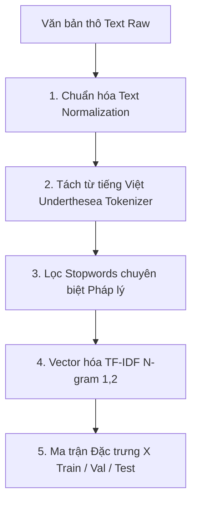

# BẢN PHÂN TÍCH CHI TIẾT ĐỀ TÀI ĐỒ ÁN MÔN HỌC MÁY HỌC

> **Đề tài:** Xây dựng hệ thống Xử lý ngôn ngữ tự nhiên tra cứu các nội dung của Luật An toàn, vệ sinh lao động  
> **Môn học:** CS114.F31.CN2.TTNT, Máy học (Machine Learning), CITD / HK3  
> **Giảng viên hướng dẫn:** ThS. Cáp Phạm Đình Thăng  
> **Tài liệu căn cứ:** [YeuCau.md](./course-requirements.md) và `TomTat.md` (tóm tắt bài giảng, chưa có trong repo)

> [!NOTE]
> **Changelog so với bản gốc (`PhanTichDetai.md`):**
> 1. Bảng nhãn 3.1: đối chiếu với văn bản gốc, mỗi Điều chỉ thuộc 1 lớp (khớp `src/config.py`). C3 = Đ21, 24, 26, 27 (Đ25 là thời giờ làm việc, chuyển về C1). **Thêm C7 `BAO_HIEM_TNLD` (Đ41–62), K = 8.** Tiêu chí gán nhãn: [labeling-guidelines.md](./labeling-guidelines.md).
> 2. Schema 3.2: thêm `seed_id`, `source`, `article_id`.
> 3. Split 3.3: chia theo nhóm `seed_id` thay vì stratified ngẫu nhiên, tránh leakage do paraphrase.
> 4. Ablation 6.2: cấu hình "bỏ tách từ" không lọc stopwords, so với cấu hình 4 thay vì Full.
> 5. Mục 7: thêm metric đánh giá retrieval và nguồn dữ liệu mức phạt.

---

## 1. BỐI CẢNH & TÍNH CẤP THIẾT CỦA ĐỀ TÀI

### 1.1. Vấn đề thực tiễn
- **Thực trạng:** Luật An toàn, vệ sinh lao động (Luật số 84/2015/QH13) và các Nghị định hướng dẫn (Nghị định 39/2016/NĐ-CP, Nghị định 12/2022/NĐ-CP quy định xử phạt vi phạm hành chính...) là hệ thống văn bản pháp luật cực kỳ quan trọng, tác động trực tiếp đến hàng chục triệu người lao động và hàng trăm nghìn doanh nghiệp tại Việt Nam.
- **Rào cản:** 
  1. Văn bản pháp luật có dung lượng lớn (93 điều, nhiều chương mục), ngôn từ hành chính khô khan, cấu trúc viện dẫn chéo phức tạp.
  2. Người lao động (công nhân, kỹ sư công trường, nhân viên văn phòng) và cán bộ quản lý (HSE, HR) khi gặp tình huống thực tế (tai nạn lao động, trang bị bảo hộ, khám sức khỏe, chế độ bồi thường) thường diễn đạt bằng **ngôn ngữ tự nhiên đời thường**, không nhớ chính xác số Điều, Khoản hay thuật ngữ luật định.
  3. Các công cụ tra cứu hiện nay chủ yếu dùng tìm kiếm từ khóa chính xác (Exact Keyword Matching), dẫn đến việc tìm không ra kết quả hoặc trả về hàng trăm văn bản không liên quan.

### 1.2. Giải pháp đề xuất từ góc độ Máy học (Machine Learning)
- Xây dựng một hệ thống thông minh kết hợp giữa **Xử lý ngôn ngữ tự nhiên (NLP) Tiếng Việt** và **Học máy (Machine Learning)**:
  - Tiếp nhận câu hỏi / tình huống thực tế của người dùng bằng ngôn ngữ tự nhiên.
  - Sử dụng mô hình Machine Learning đóng vai trò là **Bộ điều hướng ý định pháp lý (Semantic Intent Classifier)** để phân loại chính xác câu hỏi vào nhóm quy định / chương mục liên quan trong Luật.
  - Tích hợp module **Truy vấn ngữ nghĩa (Information Retrieval / Similarity Matching)** để trích xuất chính xác Điều luật cụ thể, các điều kiện áp dụng, trách nhiệm bồi thường và mức phạt vi phạm hành chính liên quan.

---

## 2. ĐỊNH HÌNH BÀI TOÁN MACHINE LEARNING (TRÁNH BẪY LẠC ĐỀ)

> [!IMPORTANT]
> **Tuân thủ tuyệt đối yêu cầu môn học:**  
> Đồ án môn học Máy học bắt buộc phải giải quyết bài toán cốt lõi bằng các thuật toán Machine Learning truyền thống (Supervised Text Classification), có hàm mất mát, tối ưu hóa trọng số, đo lường metrics trên tập Train/Val/Test độc lập. Không được làm ứng dụng "bọc API" (wrapper) gọi ChatGPT / LLM bên ngoài.

### 2.1. Bản chất toán học của bài toán
- **Loại bài toán:** Học có giám sát — Phân loại văn bản đa lớp (Supervised Multiclass Text Classification).
- **Không gian đầu vào ($X$):** Chuỗi văn bản câu hỏi / tình huống thực tế $x_i \in \mathcal{V}^*$ biểu diễn qua không gian vector đặc trưng TF-IDF $\mathbf{x}_i \in \mathbb{R}^D$.
- **Không gian đầu ra ($y$):** Nhãn danh mục pháp lý rời rạc $y_i \in \{C_0, C_1, \dots, C_{K-1}\}$ đại diện cho các nhóm chủ đề / chương trong Luật An toàn, vệ sinh lao động ($K = 8$).
- **Mục tiêu:** Huấn luyện hàm ánh xạ $f: \mathbb{R}^D \to \{C_0, \dots, C_{K-1}\}$ sao cho tối thiểu hóa hàm mất mát (Cross-Entropy / Hinge Loss) trên tập dữ liệu kiểm tra.

### 2.2. Kiến trúc hai giai đoạn của Hệ thống tra cứu (Two-stage Architecture)

```
                    ┌────────────────────────────────────────────────────────┐
                    │               NGƯỜI DÙNG NHẬP CÂU HỎI                  │
                    │ "Công nhân ngã giàn giáo thì công ty bồi thường gì?"   │
                    └──────────────────────────┬─────────────────────────────┘
                                               │
                                               ▼
                    ┌────────────────────────────────────────────────────────┐
                    │ GIAI ĐOẠN 1: BỘ PHÂN LOẠI MACHINE LEARNING             │
                    │ (Trọng tâm cốt lõi của đồ án Máy học)                  │
                    │ - Tiền xử lý NLP tiếng Việt (underthesea, stopwords)   │
                    │ - Trích xuất đặc trưng TF-IDF (1,2-gram)               │
                    │ - Bộ phân loại: So sánh MNB, Logistic, SVM, RF         │
                    └──────────────────────────┬─────────────────────────────┘
                                               │ Dự đoán Nhãn C5:
                                               │ "Chế độ bồi thường tai nạn"
                                               │ (P = 0.94)
                                               ▼
                    ┌────────────────────────────────────────────────────────┐
                    │ GIAI ĐOẠN 2: BỘ TRUY VẤN & XẾP HẠNG CHI TIẾT           │
                    │ (Information Retrieval / Similarity Matching)          │
                    │ - Khoanh vùng các Điều luật thuộc Nhóm C5 (Đ38, 39, 40)│
                    │ - Tính Cosine Similarity giữa câu hỏi và từng Điều     │
                    │ - Xếp hạng Top-1: Điều 38 (Trách nhiệm bồi thường)     │
                    └──────────────────────────┬─────────────────────────────┘
                                               │
                                               ▼
                    ┌────────────────────────────────────────────────────────┐
                    │ KẾT QUẢ HIỂN THỊ CHO NGƯỜI DÙNG:                       │
                    │ 1. Tên & Nội dung Điều 38 Luật ATVSLĐ (VBHN 2024)      │
                    │ 2. Nghĩa vụ chi trả chi phí y tế & bồi thường tháng lg │
                    │ 3. Mức phạt nếu vi phạm (Nghị định 12/2022/NĐ-CP)       │
                    └────────────────────────────────────────────────────────┘
```

---

## 3. THIẾT KẾ BỘ DỮ LIỆU (DATASET SPECIFICATION)

### 3.1. Phân nhóm nhãn phân loại ($K = 8$ Lớp)
Dựa trên cấu trúc chuẩn của Luật An toàn, vệ sinh lao động số 84/2015/QH13:

> [!NOTE]
> Đã đối chiếu với Văn bản hợp nhất 14/VBHN-VPQH (2024) của Luật 84/2015/QH13 (7 Chương, 93 Điều, đã cập nhật sửa đổi của Luật BHXH 41/2024/QH15 tại Đ42, 43, 44, 49, 53). Nguồn LuatVietnam, parse ra `data/ohs_law_articles.json` bằng `scripts/build_articles.py`.
> Phạm vi 8 lớp phủ Chương I – III (Đ1–62). **Ngoài phạm vi:** Chương IV – VII (Đ63–93: lao động đặc thù, tổ chức ATVSLĐ tại cơ sở, quản lý nhà nước, thi hành). Demo dùng ngưỡng độ tự tin để báo "có thể ngoài phạm vi".

| Nhãn ($y$) | Mã nhóm | Tên nhóm quy định pháp lý | Phạm vi Điều luật | Số mẫu dự kiến |
| :---: | :---: | :--- | :---: | :---: |
| **0** | `QUY_DINH_CHUNG` | Quy định chung, chính sách nhà nước, quyền và nghĩa vụ của người lao động & người sử dụng lao động | Điều 1 – Điều 12 | 200 |
| **1** | `BIEN_PHAP_PHONG_NGUA` | Các biện pháp phòng ngừa rủi ro, cải thiện điều kiện làm việc, máy móc thiết bị có yêu cầu nghiêm ngặt | Điều 13 – Điều 33, **trừ Đ14, 21, 23, 24, 26, 27** | 250 |
| **2** | `PHUONG_TIEN_BAO_HO` | Trang cấp phương tiện bảo vệ cá nhân, tiêu chuẩn đồ bảo hộ lao động | Điều 23 | 180 |
| **3** | `SUC_KHOE_BOI_DUONG` | Khám sức khỏe, khám phát hiện & điều trị bệnh nghề nghiệp, bồi dưỡng bằng hiện vật, điều dưỡng và quản lý sức khỏe (giám định suy giảm thuộc C7) | Điều 21, 24, 26, 27 | 220 |
| **4** | `KHAI_BAO_DIEU_TRA` | Khai báo, điều tra, thống kê và báo cáo sự cố kỹ thuật, tai nạn lao động | Điều 34 – Điều 37 | 200 |
| **5** | `CHE_DO_BOI_THUONG` | Chế độ trách nhiệm bồi thường, trợ cấp tai nạn lao động, tiền lương trong thời gian điều trị | Điều 38 – Điều 40 | 250 |
| **6** | `HUAN_LUYEN_ATLD` | Huấn luyện an toàn, vệ sinh lao động, chứng chỉ và các nhóm đối tượng bắt buộc huấn luyện | Điều 14 | 200 |
| **7** | `BAO_HIEM_TNLD` | Chế độ bảo hiểm TNLĐ-BNN do Quỹ BHXH chi trả: mức đóng, điều kiện hưởng, giám định, trợ cấp, hồ sơ | Điều 41 – Điều 62 | 200 |
| **TỔNG**| | **8 nhóm chuyên đề trọng tâm của Luật** | **Điều 1 – Điều 62** | **1.700 mẫu** |

Quy tắc: mỗi Điều thuộc **đúng 1 lớp**. Mapping nguồn duy nhất là `LABELS` trong `src/config.py`. Cách gán nhãn câu hỏi (nhất là các cặp dễ nhầm C5/C7, C4/C5, C1/C3): [labeling-guidelines.md](./labeling-guidelines.md).

### 3.2. Cấu trúc Schema của một bản ghi dữ liệu

```json
{
  "id": 1042,
  "question_raw": "Công nhân đang thi công trên giàn giáo cao bị rơi ngã gãy chân thì công ty có phải chịu toàn bộ tiền viện phí không và đền bù ra sao?",
  "question_clean": "công_nhân thi_công giàn_giáo rơi ngã gãy chân công_ty chịu toàn_bộ tiền viện_phí đền_bù",
  "label_id": 5,
  "label_code": "CHE_DO_BOI_THUONG",
  "article_id": 38,
  "target_article": "Điều 38",
  "target_article_title": "Trách nhiệm của người sử dụng lao động đối với người lao động bị tai nạn lao động, bệnh nghề nghiệp",
  "seed_id": 87,
  "source": "augmented",
  "article_clause": "38.2",
  "asks_penalty": false
}
```

- `label_id` / `label_code` **không gán tay**: suy ra từ `article_id` qua `ARTICLE_TO_LABEL` (xem [labeling-guidelines.md](./labeling-guidelines.md) mục 1).
- `seed_id`: id câu hỏi gốc mà câu này được paraphrase ra (câu gốc có `seed_id` = chính nó). Dùng để split theo nhóm.
- `source`: `real` (câu hỏi thực tế thu thập) hoặc `augmented` (sinh thêm).

### 3.3. Phương pháp thu thập & Sinh dữ liệu (Data Augmentation)
1. **Thu thập dữ liệu thực tế (Seed Data):**
   - Cào (crawl) và trích xuất các câu hỏi tư vấn pháp lý từ Cổng thông tin Bộ Lao động - Thương binh & Xã hội (molisa.gov.vn), LuatVietnam, Thư Ký Luật, DanLuat (~300 câu hỏi thực tế).
2. **Sinh dữ liệu tăng cường (Data Augmentation qua Paraphrasing):**
   - Từ mỗi Điều luật cụ thể, xây dựng các kịch bản tình huống đa dạng:
     * *Văn phong công nhân:* Câu ngắn, ngôn từ mộc mạc, dùng tiếng lóng (*"đồ bảo hộ"*, *"đền tiền"*, *"ngã giàn giáo"*, *"tai nạn nghề nghiệp"*).
     * *Văn phong nhân sự/doanh nghiệp:* Câu hỏi về thủ tục, thời hạn, trách nhiệm pháp lý (*"hồ sơ hưởng trợ cấp"*, *"trách nhiệm bồi thường"*, *"khám sức khỏe định kỳ"*).
     * *Văn phong khiếu nại/tranh chấp:* Hỏi về quyền từ chối làm việc, mức bồi thường khi doanh nghiệp không chịu trả.
3. **Quy tắc phân chia dữ liệu:**
   - Áp dụng **Stratified Group Split theo `seed_id`** (`StratifiedGroupKFold`): tỷ lệ xấp xỉ 70% Train / 15% Validation / 15% Test.
   - Toàn bộ câu paraphrase của cùng một câu seed nằm chung một tập. Nếu split ngẫu nhiên, paraphrase gần giống nhau rơi vào cả train và test, làm F1 bị thổi phồng (data leakage).
   - Tỷ lệ 8 lớp giữ gần đồng nhất trên 3 tập (kiểm chứng bằng bảng phân phối trong EDA).
   - Báo cáo thêm kết quả trên tập con `source == real` của Test để đo khả năng tổng quát trên câu hỏi thật.
   - GridSearchCV cũng dùng CV theo nhóm (`StratifiedGroupKFold(n_splits=5)`), không dùng `StratifiedKFold` thường.

---

## 4. QUY TRÌNH TIỀN XỬ LÝ NLP TIẾNG VIỆT (PREPROCESSING PIPELINE)

Quy trình tiền xử lý là chìa khóa quyết định độ chính xác trong bài toán xử lý văn bản tiếng Việt.



### 4.1. Chi tiết từng bước tiền xử lý
1. **Chuẩn hóa văn bản (Text Normalization):**
   - Chuyển mã Unicode về dạng chuẩn **NFC**.
   - Chuyển toàn bộ ký tự về chữ thường (`lower()`).
   - Loại bỏ các đường link URL, email, thẻ HTML, ký tự đặc biệt, dấu câu không cần thiết (chỉ giữ lại ký tự chữ tiếng Việt và khoảng trắng).
   - Chuẩn hóa khoảng trắng thừa.
2. **Tách từ tiếng Việt (Vietnamese Word Segmentation):**
   - **Tầm quan trọng:** Tiếng Việt là ngôn ngữ đơn lập, nhiều từ mang ý nghĩa hoàn chỉnh được tạo thành từ 2 hoặc nhiều âm tiết. Ví dụ: *"an toàn lao động"* nếu không tách từ sẽ bị hiểu thành 4 từ độc lập: *"an"*, *"toàn"*, *"lao"*, *"động"*.
   - **Công cụ:** Sử dụng thư viện `underthesea` (hoặc `pyvi`):
     ```python
     from underthesea import word_tokenize
     tokenized_text = word_tokenize(clean_text, format="text")
     # Kết quả: "an_toàn lao_động", "tai_nạn", "tiền_lương", "viện_phí"
     ```
3. **Lọc từ dừng (Stopwords Removal):**
   - Sử dụng danh sách từ dừng tiếng Việt phổ biến (như: *và, của, các, những, thì, là, mà, ở, tại, cho, để, một_cách...*).
   - **Lưu ý nghiệp vụ pháp lý:** Tuyệt đối **không loại bỏ các từ mang tính phủ định hoặc điều kiện** (*không, chưa, cấm, ngoại_trừ, trừ_khi*) vì việc xóa các từ này sẽ làm đảo ngược hoàn toàn ngữ nghĩa của điều luật.
4. **Trích xuất đặc trưng (Feature Extraction - Vectorization):**
   - Sử dụng **TF-IDF Vectorizer (`TfidfVectorizer`)**:
     * `ngram_range=(1, 2)`: Khai thác cả từ đơn (Unigram) và cụm hai từ (Bigram) để nắm bắt các thuật ngữ kép.
     * `max_features=3000 - 5000`: Giữ lại các đặc trưng có giá trị phân biệt thông tin cao nhất.
     * `sublinear_tf=True`: Áp dụng thang đo logarit $1 + \log(\text{tf})$ nhằm giảm thiểu ưu thế quá mức của các từ xuất hiện lặp lại nhiều lần trong cùng một câu hỏi.
     * `min_df=2`: Loại bỏ các từ quá hiếm (chỉ xuất hiện 1 lần trong toàn bộ tập dữ liệu).

> [!CAUTION]
> **Phòng chống triệt để Data Leakage (Nhắc nhở từ Thầy Thăng):**  
> `tfidf.fit_transform()` chỉ được gọi duy nhất trên tập `X_train`. Đối với `X_val` và `X_test`, bắt buộc chỉ gọi hàm `tfidf.transform()`!

---

## 5. THIẾT KẾ MÔ HÌNH MACHINE LEARNING & CHIẾN LƯỢC SO SÁNH

Theo đúng yêu cầu tại mục 3.3 của [YeuCau.md](./course-requirements.md), hệ thống sẽ cài đặt và so sánh **ít nhất 4 mô hình Machine Learning**:

### 5.1. Danh mục 4 mô hình Machine Learning thực nghiệm

#### Mô hình 1: Multinomial Naive Bayes (MNB) — Mô hình cơ sở (Baseline)
- **Cơ chế:** Dựa trên Định lý Bayes với giả định các từ xuất hiện độc lập có điều kiện theo từng lớp:
  $$P(C_k \mid X) \propto P(C_k) \prod_{i=1}^D P(w_i \mid C_k)$$
- **Vai trò:** Là mô hình cổ điển chuẩn mực cho bài toán Text Classification, tốc độ huấn luyện tính bằng mili-giây, làm mốc tham chiếu hiệu năng tối thiểu cho toàn bộ đồ án.

#### Mô hình 2: Logistic Regression (Multiclass OvR / Softmax)
- **Cơ chế:** Sử dụng hàm Softmax kết hợp hàm mất mát Cross-Entropy (Log Loss) để ánh xạ vector đặc trưng thành xác suất thuộc từng lớp.
- **Tinh chỉnh tham số:**
  * Thử nghiệm với các hệ số điều chuẩn $C \in [0.1, 1.0, 10.0]$ để cân bằng giữa Bias và Variance.
  * Sử dụng `class_weight='balanced'` để tự động bù trừ nếu có lớp bị lệch số lượng mẫu.

#### Mô hình 3: Linear Support Vector Machine (LinearSVC) — Mô hình ứng viên xuất sắc nhất
- **Cơ chế:** Tìm siêu phẳng phân chia tối ưu trong không gian đặc trưng TF-IDF nhiều chiều sao cho khoảng cách lề (Margin) giữa các lớp là lớn nhất:
  $$\min_{\mathbf{w}, b, \xi} \frac{1}{2} \|\mathbf{w}\|^2 + C \sum_{i=1}^m \xi_i$$
- **Lý do lựa chọn:** Trong xử lý văn bản truyền thống (dữ liệu thưa - sparse data, số chiều lớn), Linear SVM hầu như luôn đạt độ chính xác và chỉ số F1-Score vượt trội hơn hẳn các mô hình khác.

#### Mô hình 4: Random Forest Classifier (Tree-based Ensemble)
- **Cơ chế:** Tập hợp 100 - 200 cây quyết định độc lập được huấn luyện qua kỹ thuật Bagging (Bootstrap Aggregating) kết hợp ngẫu nhiên hóa đặc trưng (Feature Subsampling).
- **Lợi ích:** Cung cấp thông tin về **Feature Importance** (độ quan trọng của các từ khóa pháp lý) để giải thích cơ chế đưa ra quyết định của mô hình.

#### *(Tùy chọn mở rộng làm điểm cộng)*: Pre-trained Transformer PhoBERT
- Tận dụng mô hình ngôn ngữ `vinai/phobert-base` đã được huấn luyện sẵn trên hàng tỷ token tiếng Việt để Fine-tune trên tập dữ liệu của đồ án.
- Mục đích: So sánh đối chứng xem Deep Learning có thực sự vượt trội hơn các mô hình ML truyền thống (SVM, Logistic) trên tập dữ liệu kích thước vừa phải này hay không.

---

## 6. THỰC NGHIỆM ĐÁNH GIÁ & ABLATION STUDY (TIÊU CHUẨN THẦY THĂNG)

### 6.1. Bộ chỉ số đánh giá đa chiều (Evaluation Metrics)
1. **Accuracy (Độ chính xác tổng thể):** Tỷ lệ phần trăm các câu hỏi được phân loại đúng nhãn.
2. **Macro-Precision, Macro-Recall, Macro-F1 (Chỉ số cốt lõi):** 
   - Vì đây là bài toán phân loại đa lớp ($K = 8$), **Macro-F1 là thước đo chuẩn mực nhất** do tính trung bình bình đẳng giữa tất cả các lớp, không bị thiên vị bởi lớp có nhiều mẫu hơn.
   $$\text{Macro-F1} = \frac{1}{K} \sum_{k=0}^{K-1} F1_k$$
3. **Confusion Matrix (Ma trận nhầm lẫn):** Vẽ Heatmap để trực quan hóa rõ ràng số lượng mẫu dự đoán đúng/sai chéo giữa từng cặp lớp.

### 6.2. Yêu cầu bắt buộc: Thực nghiệm loại bỏ (Ablation Study)
Để chứng minh tính khoa học và giá trị thực tế của từng bước xử lý, nhóm thiết kế bảng thực nghiệm đối chứng sau trên mô hình tốt nhất (LinearSVC):

Mỗi cặp so sánh chỉ khác nhau **đúng 1 yếu tố** (cùng model, cùng split, cùng siêu tham số):

| # | Tách từ | Stopwords | N-gram | So với | Đo tác động của |
| :---: | :---: | :---: | :---: | :---: | :--- |
| **1 (Full)** | có | lọc | (1,2) | | Toàn bộ pipeline |
| **2** | không | không lọc | (1,2) | #4 | Tách từ tiếng Việt |
| **3** | có | lọc | (1,1) | #1 | Bigram |
| **4** | có | không lọc | (1,2) | #1 | Lọc stopwords |
| **5 (tùy chọn)** | không | không lọc | (1,1) | #2 | Bigram có bù được việc thiếu tách từ không |

> [!NOTE]
> Cấu hình không tách từ **không lọc stopwords**, vì danh sách stopwords viết ở dạng đã tách từ. Áp lên âm tiết rời sẽ phá từ ghép (vd "trang bị" mất "bị"), làm lẫn hiệu ứng. Vì vậy #2 so với #4, không so với #1.

### 6.3. Phân tích lỗi sai sâu (Error Analysis)
Nhóm sẽ mổ xẻ trực tiếp các mẫu bị dự đoán sai trên tập Test để trả lời câu hỏi của Thầy: *"Tại sao mô hình lại đoán sai ở những trường hợp này?"*:
- **Hiện tượng giao thoa ngữ nghĩa giữa C4 và C5:** Câu hỏi vừa đề cập việc khai báo sự cố tai nạn (C4), vừa hỏi về chế độ đền bù (C5).
- **Hiện tượng từ đồng nghĩa / tiếng lóng:** Các từ ngữ dân gian mà từ điển hoặc TF-IDF chưa bao phủ hết.
- **Hiện tượng câu hỏi quá ngắn:** Câu hỏi thiếu ngữ cảnh (ví dụ: *"Tiền khám sức khỏe?"*) khiến mô hình phân vân giữa C1 (Phòng ngừa) và C3 (Khám sức khỏe định kỳ).

---

## 7. MODULE TRA CỨU & TRÍCH XUẤT ĐIỀU LUẬT (INFORMATION RETRIEVAL)

Sau khi bộ phân loại ML xác định được Nhóm điều luật $C_k$, hệ thống kích hoạt module tra cứu chi tiết:

1. **Khoanh vùng cơ sở tri thức:** Lấy danh sách toàn bộ các Điều luật thuộc nhóm $C_k$ (C0: 12, C1: 15, C2: 1, C3: 4, C4: 4, C5: 3, C6: 1, C7: 22 Điều).
2. **Biểu diễn vector nội dung:** Mỗi Điều luật được biểu diễn bằng vector văn bản kết hợp từ: `Số Điều` + `Tiêu đề Điều` + `Toàn văn các Khoản/Điểm`.
3. **Tính toán độ tương đồng Cosine:**
   $$\text{Cosine\_Similarity}(\mathbf{q}, \mathbf{d}_j) = \frac{\mathbf{q} \cdot \mathbf{d}_j}{\|\mathbf{q}\| \|\mathbf{d}_j\|}$$
4. **Xếp hạng & Trích xuất kết quả:**
   - Chọn ra **Top-1 hoặc Top-2 Điều luật** có điểm tương đồng cao nhất.
   - Trích xuất:
     * Tên và số hiệu Điều luật trong Luật số 84/2015/QH13.
     * Nội dung tóm tắt quyền lợi và nghĩa vụ.
     * Mức xử phạt hành chính đối với hành vi vi phạm (tham chiếu theo Nghị định 12/2022/NĐ-CP).
5. **Dữ liệu mức phạt:** file riêng `data/penalties.json`, map `article_id` -> điều khoản NĐ 12/2022/NĐ-CP + mức phạt. Phải trích từ văn bản gốc, không tự điền.
6. **Đánh giá module tra cứu** (trên tập Test, dựa vào `article_id`):
   - **Top-1 / Top-3 Accuracy** của Điều luật trả về.
   - Đo 2 chế độ: (a) dùng nhãn thật (oracle) để đo riêng chất lượng retrieval; (b) dùng nhãn dự đoán để đo end-to-end. Chênh lệch (a) - (b) = lỗi lan truyền từ bộ phân loại.
   - Lưu ý: nhóm C2, C6 chỉ có 1 Điều nên Top-1 luôn đúng nếu phân loại đúng; báo cáo metric riêng cho các nhóm có nhiều Điều.

---

## 8. SẢN PHẨM BÀN GIAO CỦA ĐỒ ÁN (DELIVERABLES)

Theo mục 6 của [YeuCau.md](./course-requirements.md), nhóm sẽ hoàn thiện đầy đủ 3 sản phẩm:
1. **File Báo cáo Word:** Soạn thảo chuẩn mực học thuật, cấu trúc chuẩn 10 chương mục theo yêu cầu của Thầy.
2. **File Jupyter Notebook / Python Code:** Chứa toàn bộ mã nguồn sạch, có chú thích chi tiết từ khâu xử lý dữ liệu, huấn luyện mô hình, vẽ đồ thị EDA, xuất ma trận nhầm lẫn đến module tra cứu demo.
3. **Slide Báo cáo Trình bày (PowerPoint):** Thiết kế chuyên nghiệp, trực quan, tập trung vào sơ đồ kiến trúc, biểu đồ số liệu thực nghiệm và các phân tích chuyên sâu.
